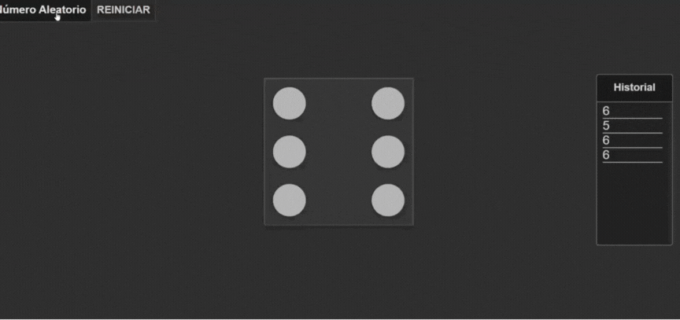

# Dado 3D Interactivo

Este proyecto es una aplicación web interactiva que simula un dado en 3D. Permite generar números aleatorios, mostrar los resultados en un historial y reiniciar el estado. Es ideal para juegos de mesa, prácticas de programación o demostraciones visuales de HTML, CSS y JavaScript.

## Características

- 🎲 **Animación en 3D:** Representación visual del dado usando CSS.
- 🎲 **Generación de números aleatorios:** Con un botón, puedes obtener un número del 1 al 6.
- 🎲 **Historial de lanzamientos:** Registra los números generados.
- 🎲 **Reinicio fácil:** Limpia el historial y restablece el dado a su estado inicial.

## Tecnologías Utilizadas

- **HTML5:** Para estructurar la interfaz de usuario.
- **CSS3:** Para los estilos y animaciones 3D del dado.
- **JavaScript:** Para la lógica interactiva y la funcionalidad.

## Archivos en el Proyecto

- `index.html`: Contiene la estructura del proyecto.
- `style.css`: Define los estilos, animaciones y diseño en 3D.
- `botones.js`: Controla las interacciones del usuario con los botones.

## Cómo Usar el Proyecto

1. Clona o descarga este repositorio en tu máquina local:
   ```bash
   git clone https://github.com/tu-usuario/dado-3d.git


## Vista Previa




## Mejoras Futuras

- 🔵 Agregar soporte para múltiples dados.
- 🔵 Personalización del estilo del dado.
- 🔵 Registro de estadísticas, como frecuencias de cada número.
- 🔵 Optimización para dispositivos móviles.

## Autor

**Santiago Hernández**  
💻 Desarrollador con experiencia en JavaScript, HTML y CSS

## Licencia

Este proyecto está bajo la Licencia MIT. Puedes usarlo y modificarlo según tus necesidades.
